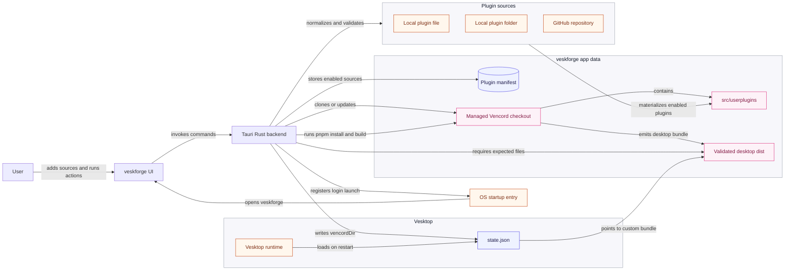

<p align="center">
  <picture>
    <source srcset="design/assets/veskforge-logo-dark.svg" media="(prefers-color-scheme: dark)">
    <source srcset="design/assets/veskforge-logo-light.svg" media="(prefers-color-scheme: light)">
    
  </picture>
</p>

<h1 align="center">veskforge</h1>

<p align="center">
  <a href="https://github.com/Microck/veskforge/releases"></a>
  <a href="https://github.com/Microck/veskforge/actions/workflows/ci.yml"></a>
  <a href="LICENSE"></a>
</p>

<p align="center">

</p>

---

`veskforge` is an unofficial desktop build manager for Vesktop users who want custom Vencord plugins without hand-running the source workflow every time. it manages a Vencord checkout, installs enabled plugins into `src/userplugins`, builds Vencord, validates the desktop `dist`, and points Vesktop at that build through Vesktop's supported `vencordDir` state setting.

## why

Vencord custom plugins are compile-time plugins. Vesktop loads a built Vencord desktop bundle, so the stable workflow is to build a custom Vencord `dist` and configure Vesktop to use it.

- keeps to Vesktop's supported custom Vencord location instead of patching installed app files
- supports local plugin files, local plugin folders, and Git plugin sources
- stores plugin state in one manifest and recreates `src/userplugins` from that manifest before each build
- validates required Vencord desktop artifacts before touching Vesktop state
- preserves unrelated Vesktop `state.json` fields when applying `vencordDir`
- can start with the OS session and check the managed Vencord checkout for updates
- defaults updates to manual apply, with explicit opt-in for startup rebuild/apply automation

## requirements

| requirement | needed for | notes |
| --- | --- | --- |
| Windows or Linux | running veskforge | Windows releases include installer builds. Linux releases include `.deb`, `.rpm`, and AppImage builds. |
| Vesktop | applying builds | veskforge writes Vesktop's `vencordDir` setting; it does not patch Vesktop binaries. |
| Git | building custom Vencord | used to clone/update Vencord and Git plugin sources. |
| Node.js | building custom Vencord | install the normal Node.js distribution that includes Corepack and npm. |
| pnpm | building custom Vencord | veskforge detects normal PATH installs plus common Windows locations such as `%APPDATA%\\npm`, `%LOCALAPPDATA%\\pnpm`, Volta, Scoop, and Node.js folders. |
| trusted custom plugins | every build | plugin code runs as application code; veskforge does not sandbox plugins. |
| Rust toolchain | building veskforge from source only | not needed when using release downloads. |

## quickstart

for normal use, install the latest build from [releases](https://github.com/Microck/veskforge/releases):

| platform | artifact |
| --- | --- |
| windows installer | `Veskforge_*_x64-setup.exe` or `.msi` |
| linux | `.deb`, `.rpm`, or `.AppImage` |

to run from source:

```bash
pnpm install --trust-policy-exclude semver@6.3.1
pnpm tauri dev
```

the `--trust-policy-exclude` flag is currently needed in this environment because pnpm blocks `semver@6.3.1` as a transitive trust-policy downgrade under `@babel/core`.

to create a linux deb package:

```bash
pnpm tauri build --bundles deb
```

the generated package is written under:

```bash
src-tauri/target/release/bundle/deb/
```

## workflow

| step | behavior |
| --- | --- |
| add plugin | paste or drop a local source file, local plugin folder, or HTTPS GitHub repo after validating the Vencord plugin entrypoint |
| build | clone or update `Vendicated/Vencord`, recreate `src/userplugins`, run `pnpm install --frozen-lockfile`, then `pnpm build` |
| validate | require `vencordDesktopMain.js`, `vencordDesktopPreload.js`, `vencordDesktopRenderer.js`, `vencordDesktopRenderer.css` |
| apply | write the validated `dist` path to Vesktop `state.json` as `vencordDir` |
| startup check | optionally launch at login, check the managed Vencord checkout, and rebuild/apply only when Auto rebuild is enabled |
| restart | fully restart Vesktop so it loads the custom Vencord build |

## architecture

veskforge keeps the risky parts explicit: plugin sources are validated before they enter the managed Vencord checkout, and Vesktop state is only updated after a desktop build produces the expected artifacts.



## plugin sources

| source | expected shape |
| --- | --- |
| local file | `.ts`, `.tsx`, `.js`, or `.jsx` Vencord module with a default export; simple `.plugin.js` files without `BdApi` usage can be wrapped at build time |
| local folder | folder containing `index.ts`, `index.tsx`, `index.js`, `index.jsx`, or exactly one `.plugin.js`; veskforge can auto-detect one nested plugin folder |
| GitHub repo | `https://github.com/owner/repo`, with optional branch, tag, or commit ref; veskforge clones and auto-detects one plugin folder |

veskforge recreates the managed Vencord `src/userplugins` folder from the manifest on each build. disabled plugins stay in the manifest but are not materialized into the next build. see [plugin source formats](docs/plugin-source-formats.md) for supported and rejected source shapes.

## paths

veskforge stores its own state in the platform app data directory. the managed Vencord checkout lives under that app data directory at:

```text
workspace/Vencord
```

Vesktop state detection checks common locations such as:

| platform | candidate |
| --- | --- |
| linux | `~/.config/vesktop/state.json` |
| linux flatpak | `~/.var/app/dev.vencord.Vesktop/config/vesktop/state.json` |
| windows | `%APPDATA%\\vesktop\\state.json` |

you can also paste a `state.json` path in the app, or set `VESKTOP_STATE_FILE` before launching veskforge.

## update model

veskforge defaults to manual updates. the app can check whether the managed Vencord checkout differs from `origin/main`; rebuilding is an explicit action unless Auto rebuild is enabled in settings.

Start at login registers veskforge with the OS session startup mechanism. On launch, veskforge checks the managed Vencord checkout. If Auto rebuild is off, it only reports the update. If Auto rebuild is on, it rebuilds the custom Vencord bundle and reapplies the validated `dist` to the detected Vesktop `state.json`.

this is intentional. Vencord and Discord internals can change, and a plugin that built yesterday may fail after an upstream update.

## design assets

logo files:

- `design/assets/veskforge-logo-light.svg`
- `design/assets/veskforge-logo-dark.svg`

see [design notes](design/README.md) for the UI direction.

## building from source

```bash
pnpm install --trust-policy-exclude semver@6.3.1
pnpm build
cd src-tauri
cargo check
```

build a desktop binary and deb package:

```bash
pnpm tauri build --bundles deb
```

build all configured linux bundles:

```bash
pnpm tauri build
```

windows installers are built by GitHub Actions on `windows-latest` using the same `pnpm tauri build` command. Tagged releases attach the NSIS `.exe` and MSI artifacts to the GitHub release.

## verification

current local verification:

| check | status |
| --- | --- |
| frontend build | `pnpm build` passes |
| rust backend | `cargo check` passes |
| rust tests | `cargo test` passes |
| linux bundles | `pnpm tauri build` passes for deb, rpm, and AppImage |
| windows installer | configured in GitHub Actions with `windows-latest` and NSIS `.exe` artifact upload |
| release binary smoke test | starts under `xvfb-run` and stays alive until timeout |
| rendered UI smoke test | checked with `agent-browser` at `http://localhost:1420/` |

## license

[mit license](LICENSE)
